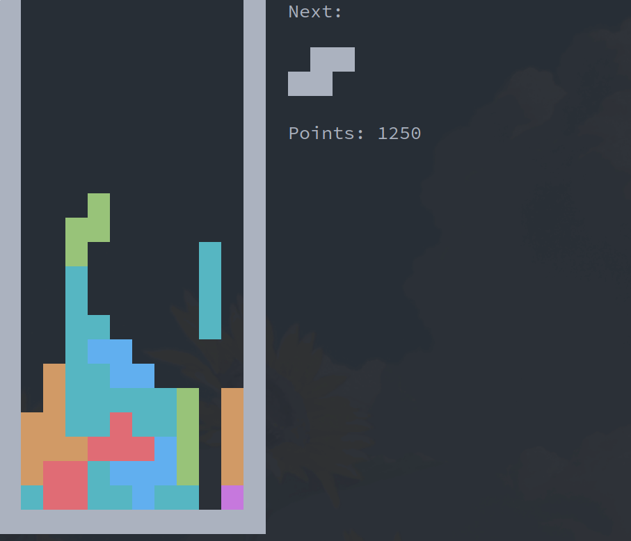

# TTY-tetris

## Play tetris from tty! (or any terminal emulator)



### How to install

#### Cloning the repo

``` sh
git clone https://github.com/hugocotoflorez/tetris
cd tetris
```

#### Fast install

``` sh
make install
tty-tetris
```
It copies the compiled binary to /usr/local/bin/, dont forget to change
the keybinds before installation. For uninstall it you can run `sudo make uninstall`.

#### Manual installation

``` sh
make all
./tty-tetris
```

### Default binds

- `w` : Rotate
- `a` : Move left
- `s` : Move right
- `d` : Move down
- `space` : Move straight down


### Features

- Point count
- Random color pieces
- Time speeds up when a piece is placed
- Lightweight and portable
- Customizable controls
- Customizable board size

### Edit controls

You can edit the binds before compilation! Just edit main.c and
edit binds by using the bind function.

`bind( key [char], function)`

Bindable functions are listed in tetris.h behind the comment // bindable functions

### How to exit

It is not implemented yet, but pressing Esc and Ctrl-C will terminate the program.
Wait a second after pressing C-c to make sure cocked mode is restored (A white rectangle
would be placed in the middle of the falling piece).

### Custom client

You can use `tetris.h` to build your own tetris machine, just make sure to
free and delete all stuff.

Fast compilation: `make compile` to get the library, and then
`gcc <your script>.c -L. -lttytetris -lpthread`, dont forget to include pthread lib!
